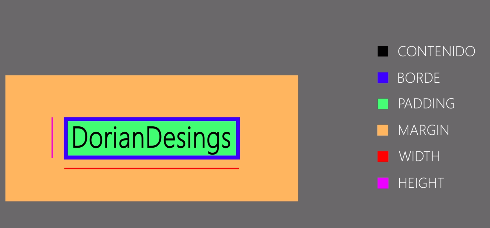

# 2 Fundamentos CSS
# ¿Cómo funciona CSS? 
1. [ Especificidad ](#schema1)
2. [Cascada](#schema2)
3. [Herencia](#schema3)
4. [Estilos computados](#schema4)
5. [Prefijos propietarios](#schema5)
6. [Box Model](#schema6)
7. [Overflow](#schema7)
8. [Colapsado de márgenes](#schema8)
9. [Display](#schema9)
10. [Outline](#schema10)
11. [Text-aling](#schema11)
12. [Box shadow](#schema12)

# 1. Especificidad 
Establece como de específico es un selectore para saber que estilo aplicar.
El cálculo se realiza con la siguiente fórmula:
Etiquetas y pseudoselementos 001
Clases, atributos y pseudoclases 010
Id 100
Estilos en líneas 1000
~~~css
h1.title#title{
    background-color:salmon;
}
~~~
`!important` si lo usamos quita todo los valores de especifidad porque se lo carga todo. Mala prática.
La mejor manera de hacerlo es usar siempre clases para ponerles los propiedades.
~~~css
.title{
    background-color: blue;
}
~~~
Con esta página podemos ver la calidad del CSS

https://jonassebastianohlsson.com/specificity-graph/

# 2. Cascada
Funciona siempre que la especificidad sobre el elemento sea la misma.
~~~css
.title{
    background-color: blue;
}
.title{
    background-color: red;
}
~~~

# 3. Herencia
Es la capacidad que tienen algunos elementos de heredar algunas propiedades de sus elementos contenedores (padres, abuelos, etc)
~~~html
 <a href="#">Enlace de ejemplo</a>
~~~
Por mucho que le intentemos cambiar el color del enlace en el archivo `styles.css` el enlace no hereda nada, porque tiene su estilo propio.
Habría que agregar una clase específica para el enlace.
~~~html
<a class="link" href="#">Enlace de ejemplo</a>
~~~
~~~css
.link{
    color:red;
}
~~~
Para forzar la herencia tenemos la palabra `inherit`
~~~css
.link{
    color:inherit;
}
~~~
Para que un elemento no herede tenemos la palabra `initial` que pone el elemento en el estado inicial.
~~~css
.list-item-extra{
    color:initial;
    
}
~~~

# 4. Estilos computados
Para abrir la herramientas de desarrollo, pulsando `f12`
### Estilos por defecto.
Cada explorador tienen sus propios estilos por defectos hay que tener en cuenta eso.
Se pueden normalizar los estilos.
Descargamos el archivo y lo guardamos en la carpeta `css` y lo tenemos que cargar antes del archivo `styles.css` en el `index.html`
https://necolas.github.io/normalize.css/

# 5. Prefijos propietarios

https://autoprefixer.github.io/

Se puede instalar el programa `prepros`. Nos genera un archivo `styles-dist.css` que contiene todos los prefijos para que la página funcione en cualquier explorador, por eso cargamos el archivo `styles-dist.css` en nuestro `index.html`. 

# 6. Box Model

### Width y height
~~~html

Elemento de bloque

<a href="#" class="inline">Elemento de linea</a>
~~~
~~~css
.block{
    background-color: purple;
    width: 100px;
    height: 100px;
}
~~~
Con los elementos en linea no tienen ni alto ni ancho, por mucho que lo pongamos. El tamaño lo determina su contenido.
~~~css
.inline{
    background-color:lightcoral;
    color:inherit;
    width: 200px;
    height: 200px;
}
~~~
### Margin
Es la propiedad que nos permite generar espacio entre elementos.
Es un shorthand (propiedad abreviada) que controloa:
 - Los 4 lados posibles a los que dar márgenes.
   - margin-top: Márgen superior
   - margin-right: Márgen derecho
   - margin-bottom: Márgen inferior
   - margin-left: Márgen izquierdo.

Admite hasta 4 valores que van el el orden de las agujas del reloj.
 - 4 valores -> margin: top right bottom left
 - 3 valores -> margin : top leff/right bottom.
 - 2 valores -> margin: top/bottom lefg/right.
 - 1 valor -> margin: top/right/bottom/leff

Los elementos en línea solo tienen márgenes horizontales. 
~~~css
title2{
    background-color: darkblue;
    width: 300px;
    margin-left: auto;
    margin-right: auto;
}
~~~

#### Errores con margin
No es buena práctica usar el `*`, porque resetea todos lo valores iniciales.
~~~css
*{
    margin: 0;
    padding: 0;
    
}
~~~
### Padding 
Es la propiedad que nos permite generar espacio interno entre el borde y la caja.
Es un shorthand (propiedad abreviada) que controloa:
 - Los 4 lados posibles a los que dar padding.
   - padding-top: padding superior
   - padding-right: padding derecho
   - padding-bottom: padding inferior
   - padding-left: padding izquierdo.
Admite hasta 4 valores que van el el orden de las agujas del reloj.
 - 4 valores -> padding: top right bottom left
 - 3 valores -> padding : top leff/right bottom.
 - 2 valores -> padding: top/bottom lefg/right.
 - 1 valor -> padding: top/right/bottom/leff

~~~css
  padding-right: 150px;
  padding-left:150px
~~~
### Border
Es la propiedad que nos permite modificar el borde de la caja.
Es un shorthand que agrupa 3 propiedades:
 - border-width: ancho del borde
   - border-top-width
   - border-right-width
   - border-bottom-width
   - border-left-width
 - border-style: estilo del borde.
   - border-top-style
   - border-right-style
   - border-bottom-style
   - border-left-style

   Listado de valores para sytle:
     - none
     - hidden
     - dotted 
     - dashed
     - solid
     - double
     - groove
     - ridge
     - inset
     - outset
 - border-color: color del borde.
   - border-top-color
   - border-right-color
   - border-bottom-color
   - border-left-color

~~~css
border: 10px solid red;
 border-right-color: blue;
~~~
### Box sizing
Es La propiedad que nos permite controlar el cálculo que hace el navegador a la hora de modificar las propiedades `content`, `padding` y `border`.
Los dos valores que podemos darle son:
 - content-box -> Valor por defecto
 - border-box -> Cálculo de tamao del elemento incluyendo el padding y el border
~~~css
box-sizing: border-box;
border: 5px solid red;
~~~
Como no es lógico poner en cada elemento `box-sizing: border-box;`, en este caso se puede usar el selector universal.
~~~css
*{
  box-sizing: border-box; 
}
~~~
### Border radius
Es la propiedad que nos permite redondear vertices de forma independient.
Es un shorthand que engloba 4 propiedades:
 - border-top-left-radis: -> Radio del borde superior izquierdo
 - border-top-right-radius: -> Radio del borde superior derecho
 - border-bottom-right-radius:-> Radio del borde inferior derecho
 - border-bottom-left-radius:-> Radio del borde inferior izquierdo

Si sólor recibe un valor dibujará un círculo en cada vértice del raiod que especifiquemos
 - border-radius: 50 px; -> Círuclo con 50 px de radio

Si utilizamos `border-radius` hay diferencias entre si queremos dar un calor a cada lado (círculo) o dos (elipse).

### Elipses
dos valores

border-radius: 10px / 50px;
 - border-top-left-radius: 10px 50px;
 - border-top-right-radius: 10px 50px;
 - border-bottom-right-radius: 10px 50px;
 - border-bottom-left-radius: 10px 50px;

# 7. Overflow
Es una propiedad que controla como se va a comportar la caja con el contenido que se desborde de ella.

Es un shorthand que engloba overflow-x y overflow-y.

Tiene 4 valores posibles:
 - visible: -> Es el valor por defecto
- hidden: Oculta todo el contenido que se desborde
 - auto: Muestra la barra de scroll solo si hace falta
 - scroll: Muestra ambas barras de scroll independientemente de si se necesitan

# 8. Colapsado de márgenes
### Márgenes verticales
Los márgenes verticales colapsan y solapan.
No tiene solución.
Pero se puede solucionar más o menos poniendo un ` margin-bottom:` al primer contenedor e ir bajando
 ~~~css
.box-a,
.box-b{
    margin-left: auto;
    margin-right: auto;
    
    background-color: lightcyan;
    width: 300px;
    height: 300px;
}
.box-a{
    margin-bottom: 30px;
}
 ~~~
### Colapsado de márgenes entre padres e hijos
Usando `overflow: hidden;` o ` padding-top: 0.1px;` o ` border-top: 0.1px solid lightcoral;`
Se puede solucionar.
 ~~~css
 .header{
    background-color: lightcoral;
    height: 100px;
    margin-bottom: 20px;
    /* overflow: hidden; */
    /* padding-top: 0.1px; */
    border-top: 0.1px solid lightcoral;
}
.title-h1{
    margin:0;
    margin-top: 50px;
}
 ~~~

# 9. Display
-Nos permite definir cómo se comporta una caja.
-De forma natural existen elementos en línea y elementos en bloque
-Los valores de esta propiedad son:
    inline – Establece que la caja se comporta como si fuera un elemento en línea.
        No admite dimensiones (width y height)
        Admiten margin y padding pero no afecta al flujo vertical,sólo al horizontal
    block - Establece que la caja se comporta como si fuera un elemento en bloque.
        Admite dimensiones (width y height)
        Admiten margin y padding y afecta al flujo vertical, sólo al horizontal.
    inline-block - Se comporta como un elemento en línea pero acepta width y heigth
    
    none – Oculta el elemento pero se sigue renderizando
    table – Imita el comportamiento de una tabla
    ~~~css
    .inline{
    background: lime;
    display: inline; 
}
    ~~~

# 10. Outline
Es ls propiedad que nos permite dibujar un borde por fuera del modelo de caja.

No ocupa sitio ya que no forma parte del box-model.

No se puede redondear.

No se pueden controlar los lados de forma independiente

~~~html

Border

   
Outline

~~~
~~~css
.border,.outline{
    background-color: #666;
    width: 100px;
    padding: 10px 25px;
    margin: 50px 100px;

}
.border{
    border: 2px solid lightcoral;
}
.outline{
   outline: 20px solid lightcoral;
   border: 5px solid lightgreen;
}
~~~

# 11. Text-aling
Es la propiedad que nos permite alinear horizontalmente el contenido de un elemento de bloque siempre que el contenido NO TENGA ANCHO DECLARADO
~~~html

Border

~~~
~~~css
.box{
    background-color: #666;
    width: 100px;
    padding: 10px 0;
    margin: 20px 0;
    border: 2px solid lightgreen;
    text-align: center;
}
~~~

# 12. Box shadow

Es una propiedad que crea una una sombra del tamaño de la caja

 - box-shdow: h-offset v-offset blur spread color inset|outset

 - h-offset: Es el desplazamiento horizontal de la sombra

 - v-offset: Es el desplazamiento vertical de la sombra

 - blur: Optional Es la cantidad de desenfoque de la sombra

 - spread: Optional Es la extensión de la sombra
color: Optional color de la sombra, si no se especifica tomará el color del texto

 - inset|outset: Optional Determina si la sombra se dibuja por dentro o por fuera de la caja

Con valor outset(default) los valores positivos añaden a derecha y abajo y los valores negativos añaden a iquierda y arriba
Con valor inset se invierten los valores, positivo sería izquierda y arriba y negativo sería derecha y abajo

 - box-shadow: 10px 10px 2px 5px red;
Sombras múltiples.

Se añaden las sombras separadas por comas
box-shadow: 10px 10px 2px 5px red, -10px -10px 2px 5px blue;

 - text-shadow: h-offset v-offset blur color
Sombras múltiples.

 - Se añaden las sombras separadas por comas text-shadow: 10px 10px 2px red, -11px -11px 2px blue;
~~~css
 box-shadow:5px 5px 10px greenyellow;
~~~